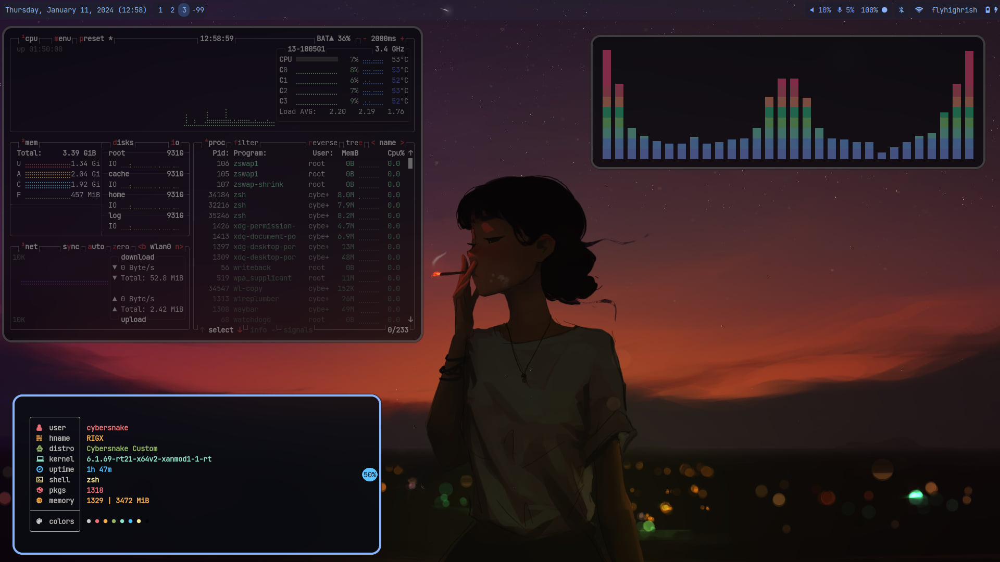
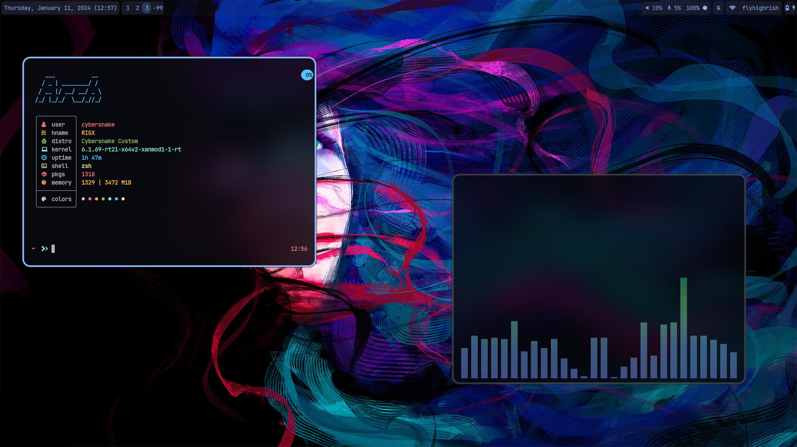
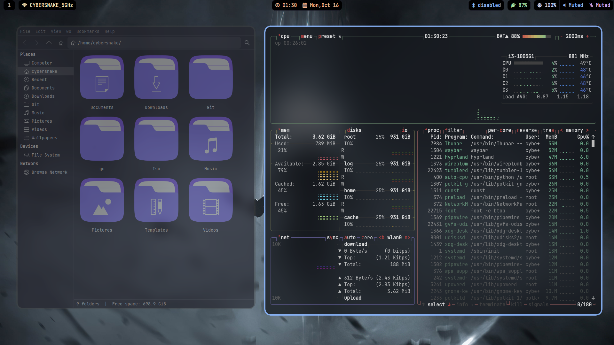
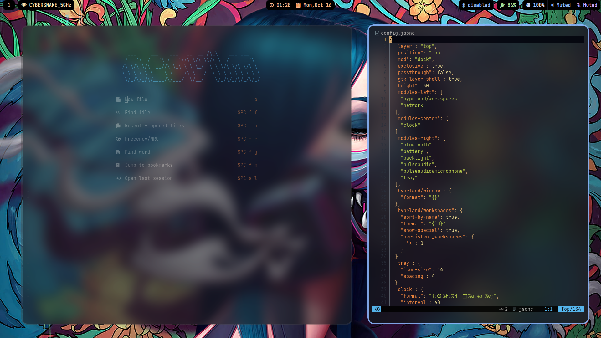

  

  
<b><i> ~ Hypr Dots ~ </i></b>

  
  
  

  

  
  - 🍀 **Distro** - [Arch](https://archlinux.org/) 
  - 🌼 **Wayland compositor** - [Hyprland](https://hyprland.org/) 
  - ✨ **Bar** - [Waybar](https://github.com/Alexays/Waybar) 
  - 💦 **File Manager** - [Thunar](https://gitlab.xfce.org/xfce/thunar) 
  - 🌷 **Terminal** - [Foot](https://github.com/DanteAlighierin/foot) 
  - 🍄 **Shell** - [Zsh](https://zsh.sourceforge.io/) 
  - 🪵 **Notifications** - [Mako](https://github.com/emersion/mako) 
  - 🌻 **Launcher** - [Rofi](https://github.com/lbonn/rofi) 
  - 🍁 **Wallpaper** - [Swaybg](https://github.com/swaywm/swaybg) 
  - ❄️ **Screen locker** - [Swaylock](https://github.com/swaywm/swaylock) 

  
  
  
| To Do | Status |
|---|---|
| Adding Blur , Rounding and Transparency | Done |
| New Waybar | Done |
| Modular Config Files | Work in progress |
