<div align="center">

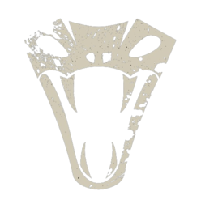

<br/>


<p>
  
  
  
  
  
</p>

<p>
  <a href="https://github.com/Cybersnake223/Hypr/commits/main">
    
  </a>
  <a href="https://github.com/Cybersnake223/Hypr/stargazers">
    
  </a>
  <a href="https://github.com/Cybersnake223/Hypr/network/members">
    
  </a>
  <a href="https://github.com/Cybersnake223/Hypr/issues">
    
  </a>
  <a href="https://github.com/Cybersnake223/Hypr/blob/main/LICENSE">
    
  </a>
  <a href="https://github.com/Cybersnake223/Hypr">
    
  </a>
</p>

<p><i>A wallpaper-synced Hyprland rice for Arch Linux.<br/>Material You theming · Automated backups · Modular installer · Clean daily workflow.</i></p>

<br/>

<br/>

**[🖼 Preview](#-preview) · [✨ Features](#-features) · [🧩 Stack](#-stack) · [📦 Prerequisites](#-prerequisites) · [⚡ Installation](#-installation) · [📂 Layout](#-file-layout) · [🚩 Flags](#-installer-flags) · [⌨️ Keybinds](#-keybinds) · [🎨 Theming](#-theming) · [🌐 Zen](#-zen-browser) · [🔄 Updating](#-updating) · [🔧 Troubleshoot](#-troubleshooting)**

</div>

<br/>

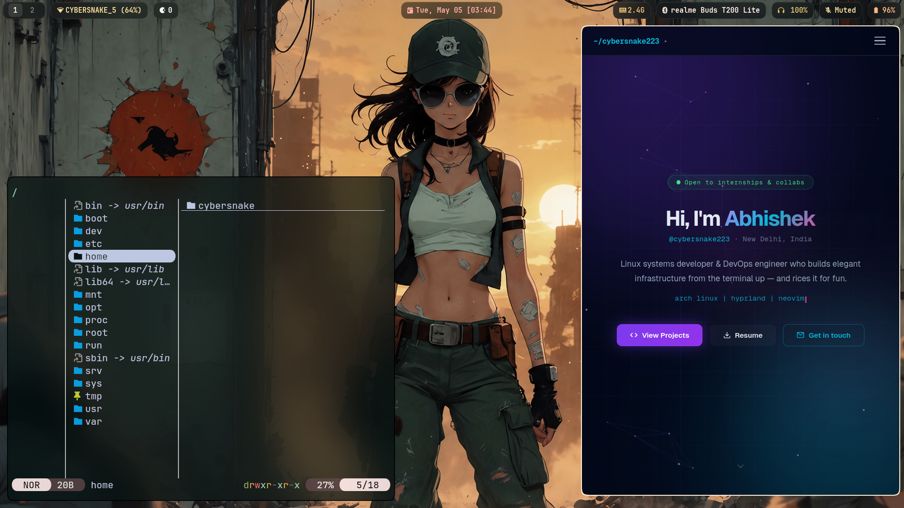

---

## 🖼 Preview

<div align="center">

<table>
  <tr>
    <td align="center"><b>Desktop · Idle</b></td>
    <td align="center"><b>Desktop · Busy</b></td>
  </tr>
  <tr>
    <td></td>
    <td>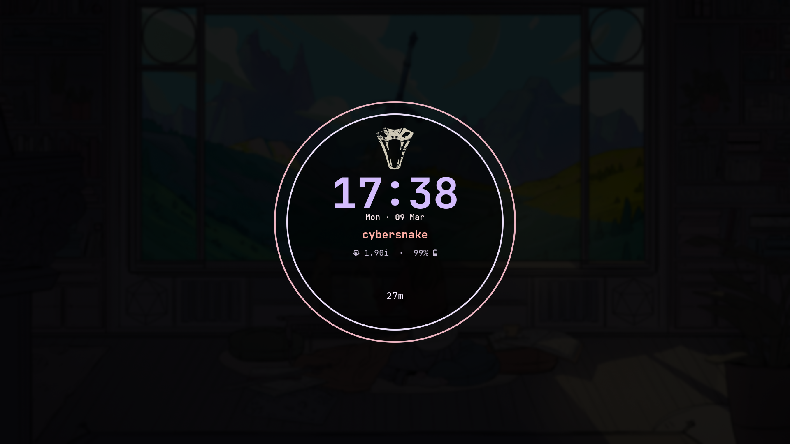</td>
  </tr>
  <tr>
    <td align="center"><b>Rofi Launcher</b></td>
    <td align="center"><b>Waybar</b></td>
  </tr>
  <tr>
    <td>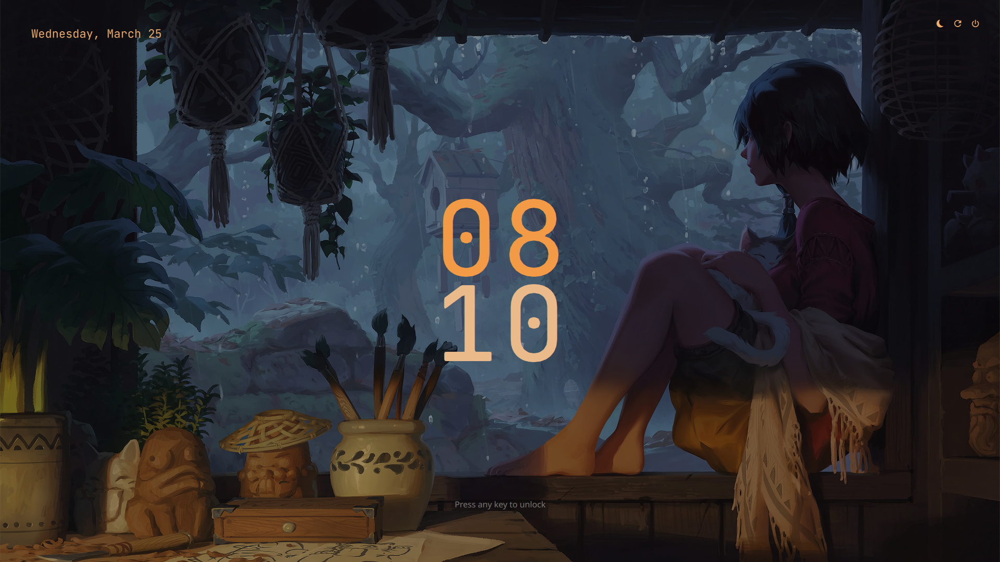</td>
    <td>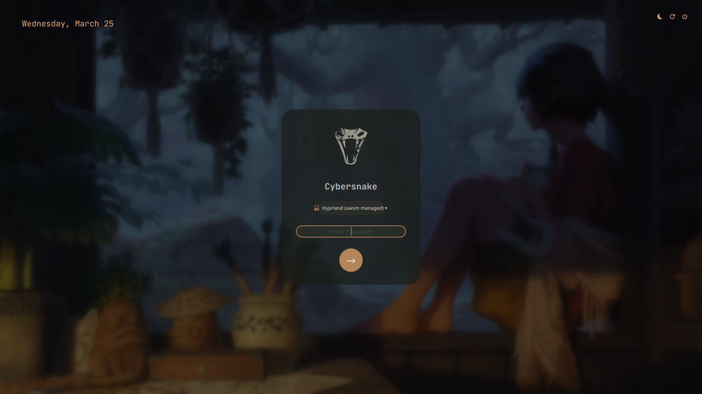</td>
  </tr>
  <tr>
    <td align="center"><b>Neovim</b></td>
    <td align="center"><b>Matugen Theming</b></td>
  </tr>
  <tr>
    <td>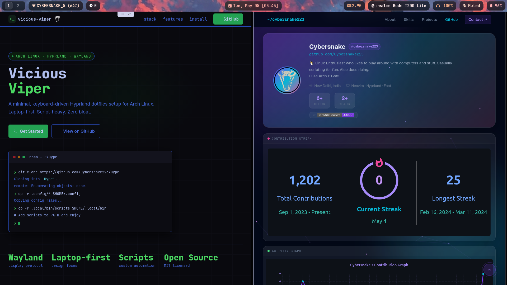</td>
    <td>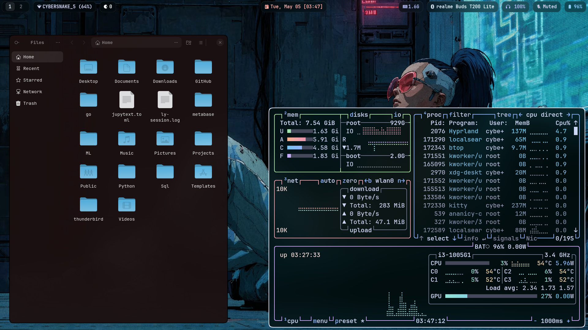</td>
  </tr>
  <tr>
    <td align="center"><b>Yazi · File Manager</b></td>
    <td align="center"><b>btop · System Monitor</b></td>
  </tr>
  <tr>
    <td>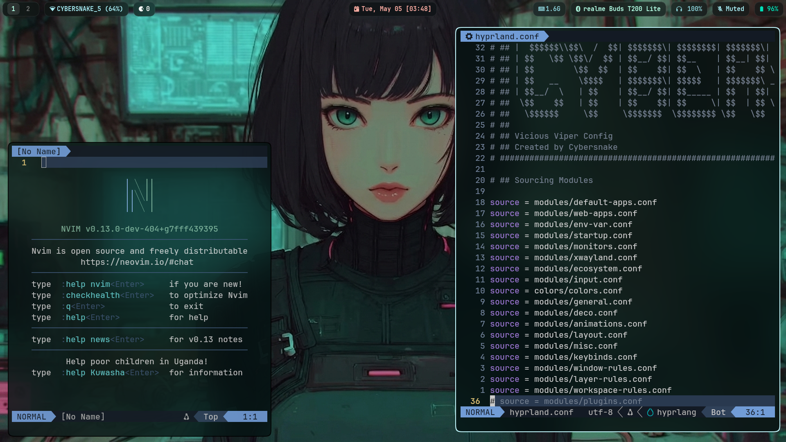</td>
    <td>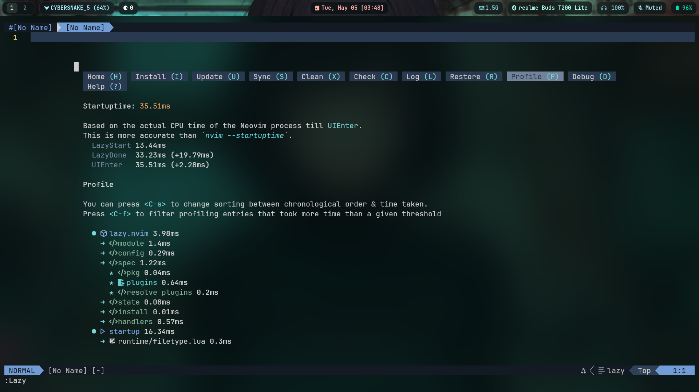</td>
  </tr>
  <tr>
    <td align="center"><b>Hyprlock</b></td>
    <td align="center"><b>Terminal · Kitty</b></td>
  </tr>
  <tr>
    <td>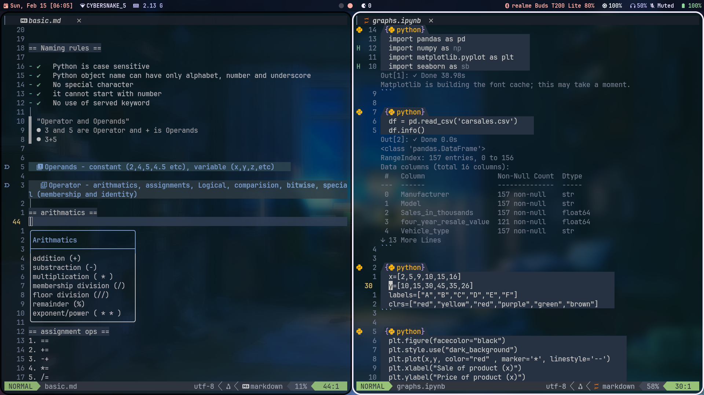</td>
    <td>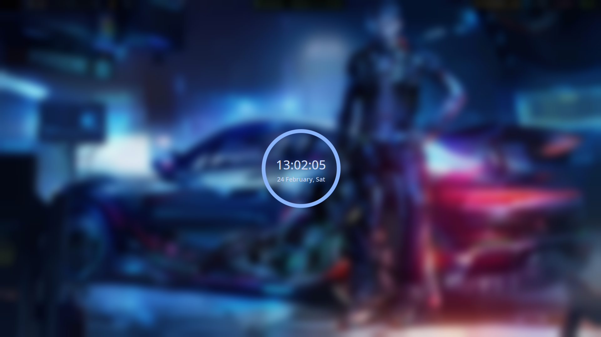</td>
  </tr>
  <tr>
    <td align="center"><b>cmus · Music</b></td>
    <td align="center"><b>Fastfetch</b></td>
  </tr>
  <tr>
    <td>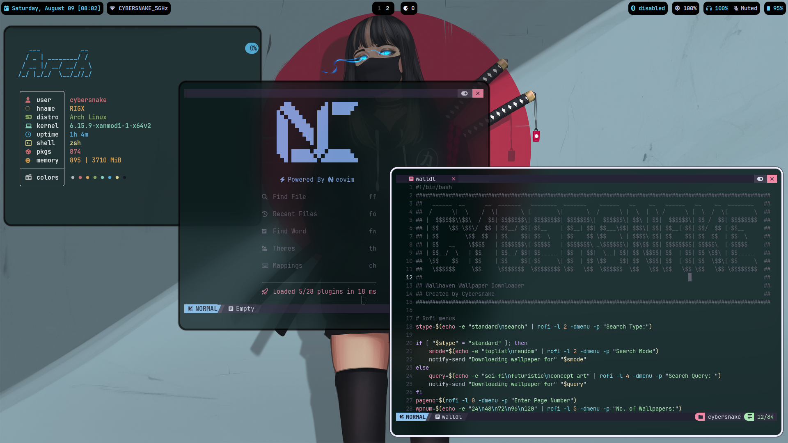</td>
    <td>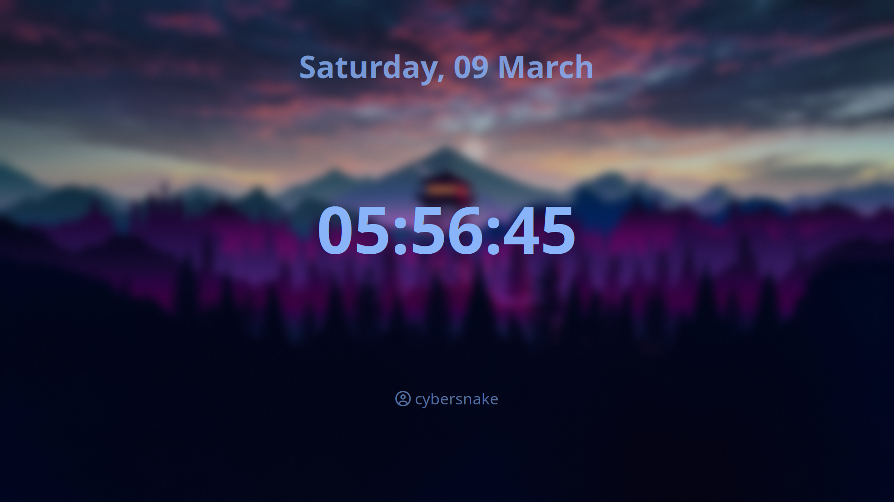</td>
  </tr>
</table>

</div>

<br/>

---

## ✨ Features

<div align="center">

| | |
|:---:|:---|
| 🔮 | **Material You theming** — Matugen derives a full color palette from your active wallpaper and applies it everywhere |
| 💾 | **Safe installer** — every overwritten file is backed up to a timestamped directory before anything is touched |
| 🎛 | **Modular installs** — pick exactly which modules to deploy: configs, scripts, icons, themes, fonts, or root dotfiles |
| 🪄 | **Dry-run mode** — preview every single action before committing a single byte |
| 🐚 | **Shell-aware PATH patching** — detects Zsh, Bash, Fish, Ksh, and falls back to POSIX `.profile` |
| ↩️ | **One-command undo** — restore your original configs with `./install.sh --uninstall` |
| 🔤 | **Bundled fonts** — JetBrains Mono Nerd, Font Awesome, Icomoon Feather, Nerd Symbols, installed and cached |
| 🌐 | **Zen Browser CSS** — custom `userChrome.css` and `userContent.css` tuned to match the Viper aesthetic |
| 📜 | **50+ custom scripts** — all automatically marked executable and added to `PATH` |

</div>

<br/>

---

## 🧩 Stack

<div align="center">

| Role | Tool |
|:---:|:---:|
| 🏗 **Base** | [Arch Linux](https://archlinux.org/) |
| 🪟 **Compositor** | [Hyprland](https://hyprland.org/) |
| 📊 **Bar** | [Waybar](https://github.com/Alexays/Waybar) |
| 🖥 **Terminal** | [Kitty](https://sw.kovidgoyal.net/kitty/) + [Foot](https://codeberg.org/dnkl/foot) |
| 🐚 **Shell** | [Zsh](https://zsh.sourceforge.io/) + [Starship](https://starship.rs/) |
| 🔔 **Notifications** | [Mako](https://github.com/emersion/mako) |
| 🚀 **Launcher** | [Rofi Wayland](https://github.com/lbonn/rofi) |
| 🌐 **Browser** | [Zen Browser](https://zen-browser.app/) |
| 🔒 **Locker** | [Hyprlock](https://github.com/hyprwm/hyprlock) |
| 📁 **Files** | [Nautilus](https://gitlab.gnome.org/GNOME/nautilus) · [Yazi](https://yazi-rs.github.io/) |
| 📝 **Editor** | [Neovim](https://neovim.io/) |
| 🎨 **Theming** | [Matugen](https://github.com/InioX/matugen) |
| 📡 **System Info** | [Fastfetch](https://github.com/fastfetch-cli/fastfetch) |
| 🎵 **Audio** | [cmus](https://cmus.github.io/) · [Cava](https://github.com/karlstav/cava) · [mpv](https://mpv.io/) |
| 📈 **Monitor** | [btop](https://github.com/aristocratos/btop) |
| ⬇ **Downloads** | [aria2](https://aria2.github.io/) |

</div>

<br/>

---

## 📦 Prerequisites

> [!IMPORTANT]
> The installer checks for these packages and warns about anything missing. It will **not** block installation unless core system utilities like `cp` or `find` are absent.

### Core packages

```bash
yay -S hyprland waybar foot kitty zsh rofi-lbonn-wayland-git mako       \
        hyprlock matugen-bin btop yazi fastfetch neovim starship          \
        cava cmus mpv nautilus zen-browser-bin aria2 advcpmv
```

### Supporting packages

<details>
<summary>Click to expand full list</summary>

<br/>

| Package | Purpose |
|---|---|
| `xdg-desktop-portal-hyprland` | Wayland portal — screenshare, file picker |
| `polkit-gnome` | GUI auth agent |
| `grim` + `slurp` + `wl-clipboard` | Screenshot toolchain |
| `brightnessctl` | Brightness control |
| `pavucontrol` | Volume GUI |
| `pipewire` + `pipewire-pulse` + `pipewire-alsa` | Audio stack |
| `wireplumber` | PipeWire session manager |
| `networkmanager` | Networking |
| `bluez` + `bluez-tools` | Bluetooth |
| `xorg-xwayland` | X11 app compatibility |
| `eza` | Better `ls` |
| `fd` | Better `find` |
| `bat` | Better `cat` |
| `bleachbit` | System cleaner script dependency |

</details>

### Fonts

The `.fonts/` directory is bundled and installed automatically. To install manually:

```bash
yay -S ttf-jetbrains-mono-nerd ttf-font-awesome nerd-fonts-symbols-only
fc-cache -f
```

<br/>

---

## ⚡ Installation

> [!CAUTION]
> Always run `--dry-run` first on an existing setup. The installer backs up files it overwrites, but you should confirm what it touches before committing.

### Quick start

```bash
git clone https://github.com/Cybersnake223/Hypr
cd Hypr
chmod +x install.sh
./install.sh --dry-run   # preview first
./install.sh             # run when happy
```

### What happens during install
