<div align="center">

<picture>
  <source media="(prefers-color-scheme: dark)" srcset="https://capsule-render.vercel.app/api?type=waving&color=6D2E8F&height=100&section=header"/>
  
</picture>

<br/>

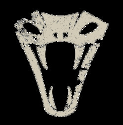

<br/>
<br/>

# Vicious Viper

<p>
  
  
  
  
  
</p>

<p>
  <a href="https://github.com/Cybersnake223/Hypr/commits/main">
    
  </a>
  <a href="https://github.com/Cybersnake223/Hypr/stargazers">
    
  </a>
  <a href="https://github.com/Cybersnake223/Hypr/network/members">
    
  </a>
  <a href="https://github.com/Cybersnake223/Hypr/issues">
    
  </a>
  <a href="https://github.com/Cybersnake223/Hypr/blob/main/LICENSE">
    
  </a>
  <a href="https://github.com/Cybersnake223/Hypr">
    
  </a>
</p>

<p><i>A wallpaper-synced Hyprland rice for Arch Linux.<br/>Material You theming · Automated backups · Modular installer · Clean daily workflow.</i></p>

<br/>

<details>
<summary><b>📖 Table of Contents</b></summary>

**[🖼 Preview](#-preview) · [✨ Features](#-features) · [🧩 Stack](#-stack) · [📝 Neovim](#-neovim)**  
**[📦 Prerequisites](#-prerequisites) · [⚡ Installation](#-installation) · [🚀 Post-Install](#-post-install)**  
**[📂 Layout](#-file-layout) · [🚩 Flags](#-installer-flags) · [⌨️ Keybinds](#-keybinds)**  
**[🎨 Theming](#-theming) · [🎛 Quickshell](#-quickshell-panels--osd) · [🌐 Zen](#-zen-browser)**  
**[🔄 Updating](#-updating) · [🔧 Troubleshoot](#-troubleshooting) · [🔐 Security](#-security) · [🤝 Contributing](#-contributing) · [📄 License](#-license)**

</details>

</div>

<br/>


<div align="center">

</div>


## 🖼 Preview

<div align="center">

<table>
  <tr>
    <td>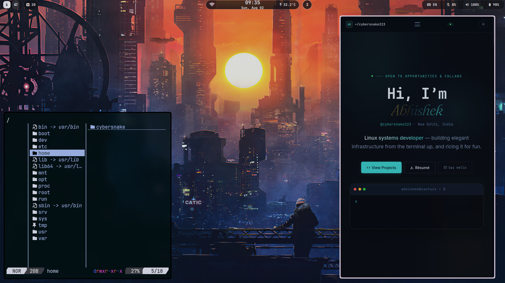</td>
    <td>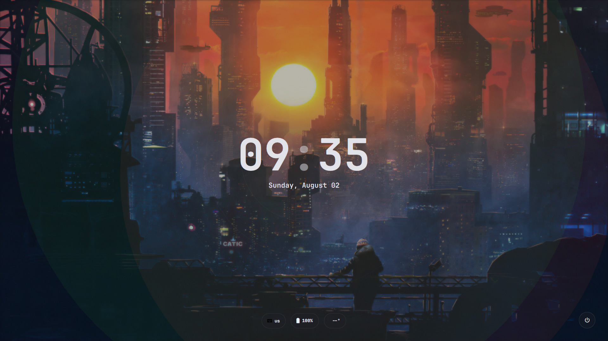</td>
  </tr>
  <tr>
    <td>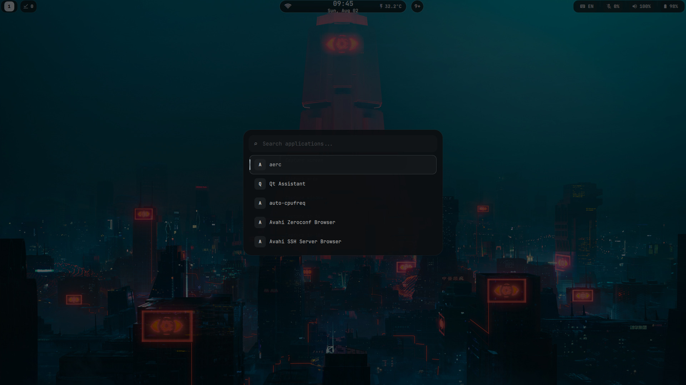</td>
    <td>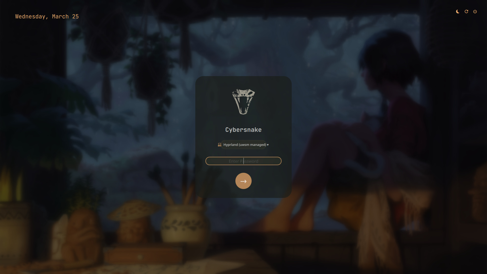</td>
  </tr>
  <tr>
    <td>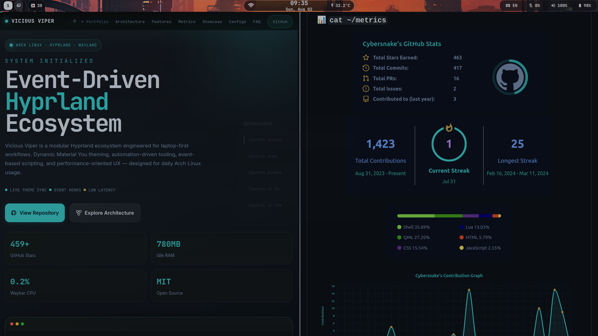</td>
    <td>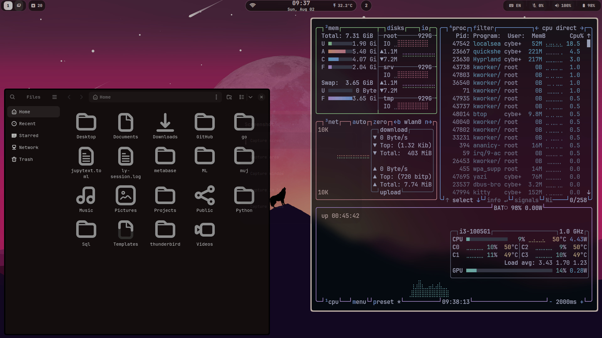</td>
  </tr>
  <tr>
    <td>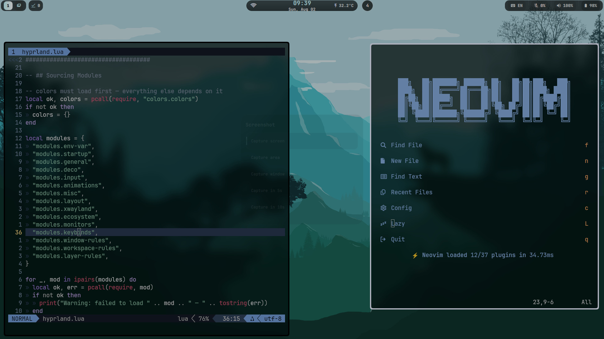</td>
    <td>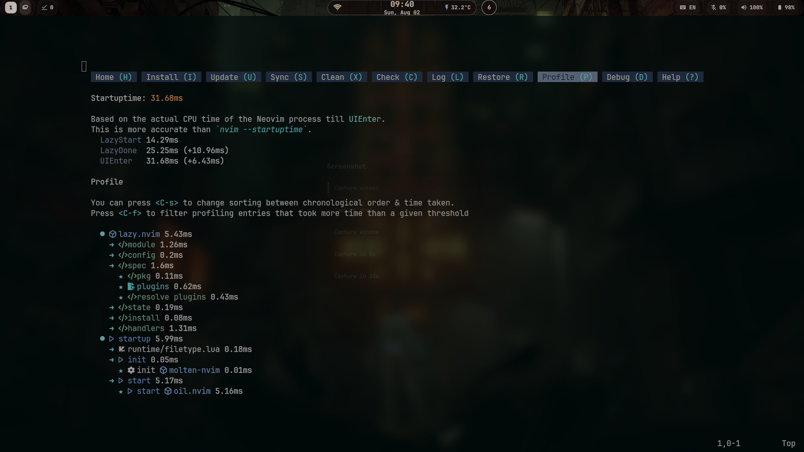</td>
  </tr>
  <tr>
    <td>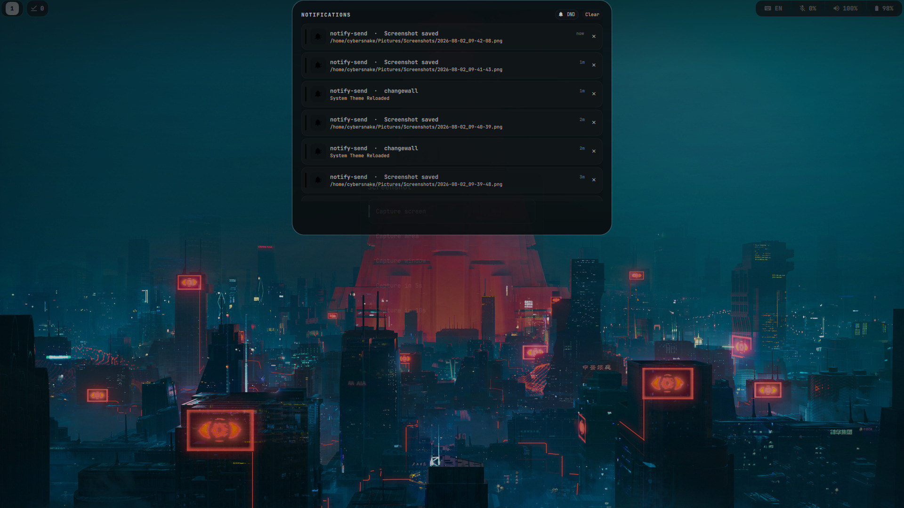</td>
    <td>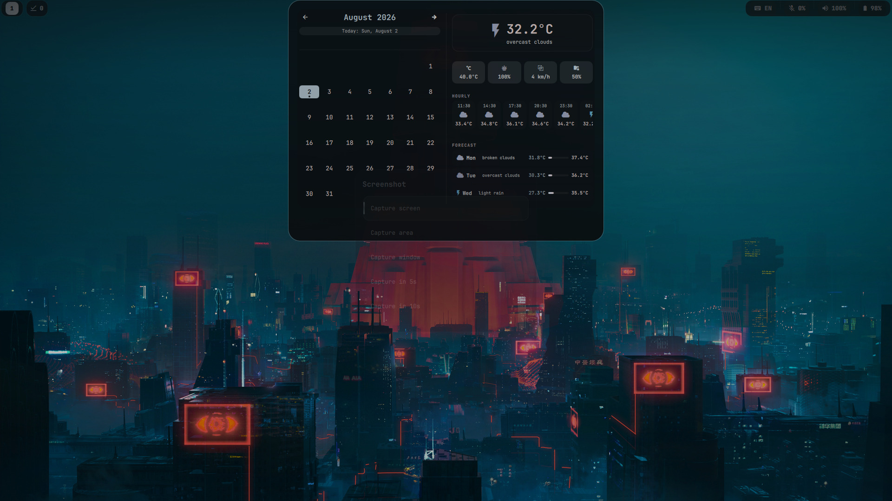</td>
  </tr>
  <tr>
    <td>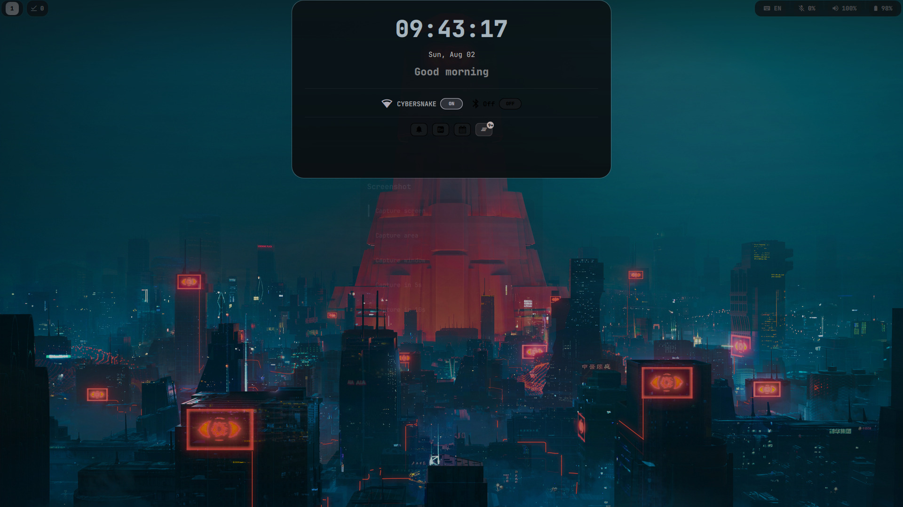</td>
    <td>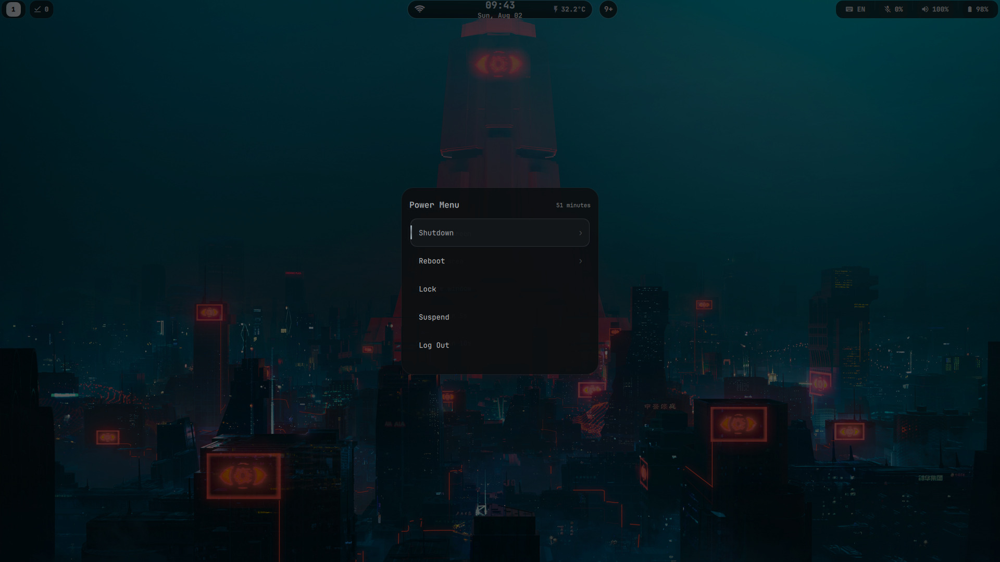</td>
  </tr>
</table>

</div>

<br/>


<div align="center">

</div>


## ✨ Features

<div align="center">

|                                                       🔮                                                        |                                                   💾                                                    |                                                       🎛                                                        |                                      🪄                                       |                                                🐚                                                |
| :-------------------------------------------------------------------------------------------------------------: | :-----------------------------------------------------------------------------------------------------: | :-------------------------------------------------------------------------------------------------------------: | :---------------------------------------------------------------------------: | :----------------------------------------------------------------------------------------------: |
| **Material You theming** — Matugen derives a full palette from your wallpaper and applies it to every component | **Safe installer** — every file that would be overwritten is backed up to a timestamped directory first | **Modular installs** — choose exactly which modules to deploy: configs, scripts, icons, themes, fonts, dotfiles | **Dry-run mode** — preview every single action without touching a single file | **Shell-aware PATH patching** — detects Zsh, Bash, Fish, Ksh, and falls back to POSIX `.profile` |

|                                        ↩️                                         |                                                     🔤                                                      |                                                   🌐                                                   |                                        📜                                        |                                       🎨                                        |
| :-------------------------------------------------------------------------------: | :---------------------------------------------------------------------------------------------------------: | :----------------------------------------------------------------------------------------------------: | :------------------------------------------------------------------------------: | :-----------------------------------------------------------------------------: |
| **One-command undo** — restore all your originals with `./install.sh --uninstall` | **Bundled fonts** — JetBrains Mono Nerd, Font Awesome, Icomoon Feather, Nerd Symbols — installed and cached | **Zen Browser CSS** — custom `userChrome.css` and `userContent.css` tuned to match the Viper aesthetic | **33 custom scripts** — automatically marked executable and patched into `PATH` | **Live theming** — change wallpaper, run matugen, everything recolors instantly |

</div>

<br/>


<div align="center">

</div>


## 🧩 Stack

<div align="center">

|     Role     | Tool                                                                                                                                 |
| :----------: | :----------------------------------------------------------------------------------------------------------------------------------- |
| 🏗 **Base**  | [](https://archlinux.org/) |
| 🪟 **Compositor** | [](https://hyprland.org/) |
| 📊 **Bar**   | [](https://github.com/Alexays/Waybar) |
| 🎛 **Panels** | [](https://github.com/Quickshell/Quickshell) — dynamic island, OSD, launcher |
| 🖥 **Terminal** | [](https://sw.kovidgoyal.net/kitty/) + [](https://codeberg.org/dnkl/foot) |
| 🐚 **Shell** | [](https://zsh.sourceforge.io/) + [](https://starship.rs/) |
| 🔔 **Notifications** | [](https://github.com/emersion/mako) |
| 🚀 **Launcher** | [](https://github.com/Quickshell/Quickshell) + [](https://github.com/lbonn/rofi) |
| 🌐 **Browser** | [](https://zen-browser.app/) |
| 🔒 **Locker** | [](https://github.com/Quickshell/Quickshell) (QML lock screen) |
| 📁 **Files** | [](https://gitlab.gnome.org/GNOME/nautilus) + [](https://yazi-rs.github.io/) |
| 📝 **Editor** | [](https://neovim.io/) |
| 🖼 **Wallpaper** | [](https://github.com/InioX/awww) + [](https://github.com/InioX/hyprwat) |
| 🎨 **Theming** | [](https://github.com/InioX/matugen) |
| 📡 **System Info** | [](https://github.com/fastfetch-cli/fastfetch) |
| 🎵 **Audio** | [](https://cmus.github.io/) + [](https://github.com/karlstav/cava) + [](https://mpv.io/) |
| 📈 **Monitor** | [](https://github.com/aristocratos/btop) |
| ⬇ **Downloads** | [](https://aria2.github.io/) |

</div>

<br/>


<div align="center">

</div>


## 📝 Neovim

The Neovim config (`.config/nvim/`) is a modern Lua-based setup:

| Component          | Tool                                         |
| ------------------ | -------------------------------------------- |
| **Plugin manager** | [lazy.nvim](https://github.com/folke/lazy.nvim) |
| **LSP**            | [Mason](https://github.com/williamboman/mason.nvim) — auto-installs language servers |
| **Completion**     | [nvim-cmp](https://github.com/hrsh7th/nvim-cmp) |
| **Telescope**      | Fuzzy finder for files, grep, buffers        |
| **Treesitter**     | Syntax highlighting and parsing              |

System dependencies (`--install-nvim-deps`): `wl-clipboard`, `python`, `imagemagick`, `luarocks`, `shellcheck`, `gcc`, `nodejs`, `npm`.

> [!NOTE]
> After first Neovim launch, run `:MasonInstallAll` to install LSP servers and formatters.

<br/>


<div align="center">

</div>


## 📦 Prerequisites

> [!IMPORTANT]
> The installer checks for these and warns about anything missing. It will not block installation unless core system utilities like `cp` or `find` are absent.

> [!TIP]
> If you don't have an AUR helper, install `yay` first:
> ```bash
> sudo pacman -S --needed git base-devel
> git clone https://aur.archlinux.org/yay.git /tmp/yay
> cd /tmp/yay && makepkg -si
> ```

### Tested On

|                |                                                   |
| :------------: | :------------------------------------------------ |
|   🖥 **OS**    | Arch Linux (latest)                               |
|      GPU       | Intel / AMD / NVIDIA (all supported via Hyprland) |
| 🪟 **Display** | Wayland (Hyprland)                                |

> [!NOTE]
> Zsh configs use `ZDOTDIR=$HOME/.config/zsh`. Set this before first launch:
> ```bash
> echo 'export ZDOTDIR="$HOME/.config/zsh"' > ~/.zshenv
> ```

### Core packages

```bash
yay -S hyprland waybar foot kitty zsh rofi mako \
        matugen-bin btop yazi fastfetch neovim starship \
        cava cmus mpv nautilus zen-browser-bin aria2 advcpmv \
        quickshell hyprwat
```

### Supporting packages

<details>
<summary>Click to expand</summary>

<br/>

| Package                                         | Purpose                                   |
| ----------------------------------------------- | ----------------------------------------- |
| `xdg-desktop-portal-hyprland`                   | Wayland portal — screenshare, file picker |
| `polkit-gnome`                                  | GUI authentication agent                  |
| `grim` + `slurp` + `wl-clipboard`               | Screenshot toolchain                      |
| `brightnessctl`                                 | Brightness control                        |
| `pavucontrol`                                   | Audio volume GUI                          |
| `pipewire` + `pipewire-pulse` + `pipewire-alsa` | Audio stack                               |
| `wireplumber`                                   | PipeWire session manager                  |
| `networkmanager`                                | Networking                                |
| `bluez` + `bluez-tools`                         | Bluetooth                                 |
| `xorg-xwayland`                                 | X11 app compatibility                     |
| `eza`                                           | Better `ls`                               |
| `fd`                                            | Better `find`                             |
| `bat`                                           | Better `cat`                              |
| `bleachbit`                                     | System cleaner script dependency          |
| `neomutt`                                        | Terminal email client (`ALT + T`)          |
| `aerc`                                          | Terminal email client (bundled config)     |
| `localsend`                                     | Local file sharing (`ALT + S`)            |
| `nsxiv`                                         | Image viewer (used in scripts)            |
| `wiremix`                                       | Audio mixer (`ALT SHIFT + P`)            |

</details>

### Fonts

The `.fonts/` directory is bundled and installed automatically. It is organized into three subdirectories:

| Directory         | Contents                                                   |
| ----------------- | ---------------------------------------------------------- |
| `normal-fonts/`   | Comfortaa, IBM Plex Mono, JetBrainsMono, Iosevka           |
| `nerd-fonts/`     | JetBrains Mono Nerd, Fira Code Nerd, Hack Nerd, Iosevka    |
| `icon-fonts/`     | Material Icons, Icomoon Feather, Nerd Symbols, Typicons    |

To install manually:

```bash
yay -S ttf-jetbrains-mono-nerd ttf-font-awesome nerd-fonts-symbols-only
fc-cache -f
```

<br/>


<div align="center">

</div>


## ⚡ Installation

> [!CAUTION]
> Run `--dry-run` first on an existing setup. The installer backs up every file it will overwrite, but you should always confirm what it touches before committing.

### Quick start

```bash
git clone https://github.com/Cybersnake223/Hypr
cd Hypr
chmod +x install.sh
./install.sh --dry-run   # preview first
./install.sh             # install when ready
```

### What happens during install

<table align="center" bgcolor="#0d0d0d">
<tr>
<td align="center">
<sub>🟥 🟨 🟢 &nbsp; <code>install.sh</code></sub>
</td>
</tr>
<tr>
<td>

<pre align="left"><code>[1] ✅  Verify core system utilities
[2] 🔍  Check Hyprland ecosystem packages
[3] 📦  Check Neovim system dependencies
[4] 💾  Backup all files that will be overwritten
[5] 📁  Copy selected modules into $HOME
[6] 🔑  chmod +x all scripts
[7] 🔤  Rebuild font cache (fc-cache -f)
[8] 🛤  Detect shell, patch PATH
[9] 📋  Print install summary + log path</code></pre>

</td>
</tr>
</table>

Backups land here:

```
~/.local/share/hypr-dotfiles-backups/<YYYYMMDD-HHMMSS>/
```

Each backup contains a `.manifest` of every installed path — used by `--uninstall` to restore precisely.

### Manual install (no script)

The installer is just a Bash script — review it, then replicate manually:

```bash
for dir in .config .icons .themes .fonts; do
  [ -d "$dir" ] && cp -r "$dir" "$HOME/"
done
[ -d .local/bin/scripts ] && cp -r .local/bin/scripts "$HOME/.local/bin/"
for f in .Xresources .gtkrc-2.0; do
  [ -f "$f" ] && cp "$f" "$HOME/"
done

# Copy Quickshell QML configs separately
[ -d .config/quickshell ] && cp -r .config/quickshell "$HOME/.config/"
[ -d .config/matugen ] && cp -r .config/matugen "$HOME/.config/"
[ -f .config/qt5ct/qt5ct.conf ] && mkdir -p "$HOME/.config/qt5ct" \
  && cp .config/qt5ct/qt5ct.conf "$HOME/.config/qt5ct/"

find "$HOME/.local/bin/scripts" -type f -exec chmod +x {} +
fc-cache -f
echo 'export PATH="$HOME/.local/bin:$PATH"' >> ~/.zshrc

# Start Quickshell panels
~/.config/hypr/scripts/qs_manager.sh &
```

<br/>


<div align="center">

</div>


## 🚀 Post-Install

After the installer finishes:

1. **Enable system services** (if this is a fresh Arch install):
   ```bash
   systemctl --user enable --now pipewire pipewire-pulse wireplumber
   sudo systemctl enable --now bluetooth networkmanager
   ```
2. **Set ZDOTDIR** (if using Zsh with this config):
   ```bash
   echo 'export ZDOTDIR="$HOME/.config/zsh"' > ~/.zshenv
   ```
3. **Reload your shell** or log out and back in.
4. **Start Hyprland**: run `Hyprland` from a TTY or select it in your display manager.
5. **Run `:MasonInstallAll`** inside Neovim on first launch to install LSP servers and formatters.

> [!TIP]
> The installer backs up everything it overwrites. If something goes wrong, run `./install.sh --uninstall` to restore your originals.

<br/>


<div align="center">

</div>


## 📂 File Layout

```
$HOME
├── .config/
│   ├── hypr/             ← Hyprland (Lua config; hyprlock, hypridle, hyprpaper)
│   ├── waybar/           ← Status bar
│   ├── quickshell/       ← QML panels, launcher, OSD, lock screen
│   ├── rofi/             ← App launcher
│   ├── nvim/             ← Neovim (Lua, lazy.nvim)
│   ├── zsh/              ← Zsh (uses $ZDOTDIR)
│   ├── kitty/            ← Kitty terminal
│   ├── foot/             ← Foot terminal
│   ├── mako/             ← Notifications
│   ├── yazi/             ← TUI file manager
│   ├── mpv/              ← Media player
│   ├── btop/             ← System monitor
│   ├── matugen/          ← Matugen config + 20 color templates
│   ├── fastfetch/        ← System info
│   ├── starship.toml     ← Prompt
│   ├── cava/             ← Audio visualizer
│   ├── anyrun/           ← Alternative launcher (Rust)
│   ├── bat/              ← Cat replacement
│   ├── aerc/             ← Terminal email client (bundled config)
│   ├── cmus/             ← Music player
│   ├── environment.d/    ← Environment variables
│   ├── fsh/              ← Fish shell config
│   ├── gtk-2.0/          ← GTK2 theme
│   ├── gtk-3.0/          ← GTK3 CSS (Matugen-recolored)
│   ├── gtk-4.0/          ← GTK4 CSS (Matugen-recolored)
│   ├── hyprwat/          ← Wallpaper picker GUI
│   ├── Kvantum/          ← Qt theme engine
│   ├── qt5ct/            ← Qt5 settings
│   ├── qt6ct/            ← Qt6 settings
│   ├── zen/              ← Zen Browser CSS (userChrome/userContent)
│   ├── xsettingsd/       ← X settings daemon (GTK theming bridge)
│   ├── yay/              ← AUR helper config
│   └── ...
├── .local/bin/scripts/   ← 33 custom shell scripts
├── .fonts/               ← Bundled fonts
├── .icons/               ← Icon theme
├── .themes/              ← GTK/Qt themes
├── .Xresources
├── .gtkrc-2.0
├── .zen/                 ← Zen Browser profile (custom CSS copied here manually — see Zen section)
└── assets/               ← Screenshots and logo

/etc/ (system-level — not installed, apply manually):
├── auto-cpufreq.conf    ← CPU governor tuning
├── pacman.conf          ← Pacman parallel downloads + eye candy
└── pacman.d/

> ⚠️ **Security notes:** `etc/pacman.conf` sets `SigLevel = Optional TrustAll`, which
> disables package signature verification — convenient on a personal machine but not
> recommended to copy verbatim. `.config/environment.d/zen.conf` sets
> `MOZ_DISABLE_RDD_SANDBOX=1`, which disables Firefox's media-decoder sandbox to
> allow hardware video decode; a known tradeoff between security and performance.
```

<br/>


<div align="center">

</div>


## 🚩 Installer Flags

<div align="center">

|       Flag               | What it does                                     |
| :----------------------: | :----------------------------------------------- |
|   `--dry-run`            | 🔍 Preview every action — zero changes made      |
|     `--yes`              | ✅ Skip all confirmation prompts                 |
|    `--select`            | 🎛 Interactively pick which modules to install   |
|  `--no-backup`           | ⚠️ Skip backup — also disables `--uninstall`     |
|  `--uninstall`           | ↩️ Restore originals from the most recent backup |
| `--list-backups`         | 📋 Show all backups with timestamps and sizes    |
|  `--install-deps`        | 📦 Auto-install missing Hyprland ecosystem deps  |
| `--install-all-deps`     | 📦 Ecosystem + supporting packages (pipewire, bluez, grim…) |
|  `--install-nvim-deps`    | 📦 Auto-install Neovim system dependencies       |
|  `--skip-deps`           | 🚀 Skip the ecosystem dependency check           |
|  `--version`             | ℹ️  Show version and exit                        |
|  `-h / --help`           | 📖 Show usage                                    |

</div>

```bash
# Full install with all dependencies (recommended for first-timers)
./install.sh --install-all-deps --yes

# First-timer recommended flow (preview before committing)
./install.sh --dry-run

# Standard install
./install.sh

# Non-interactive (CI / scripted)
./install.sh --yes --skip-deps

# Pick only what you want
./install.sh --select

# Undo the last install
./install.sh --uninstall

# See all saved backups
./install.sh --list-backups
```

### `--select` module picker

```
[✓]  1  .config       Application configs (hypr, waybar, rofi, nvim, zsh…)
[✓]  2  scripts       Custom scripts → ~/.local/bin/scripts
[ ]  3  .icons        Icon theme
[✓]  4  .themes       GTK/Qt themes
[✓]  5  .fonts        Custom fonts (triggers fc-cache rebuild)
[✓]  6  dotfiles      Root dotfiles (.Xresources, .gtkrc-2.0)
```

Toggle a number, press Enter to confirm.

### Shell-aware PATH patching

| Shell        | Line added                              | File patched                           |
| ------------ | --------------------------------------- | -------------------------------------- |
| `zsh`        | `path=(~/.local/bin $path)`             | `~/.zshrc`                             |
| `bash`       | `export PATH="$HOME/.local/bin:$PATH"`  | `~/.bashrc`                            |
| `fish`       | `fish_add_path $HOME/.local/bin`        | `~/.config/fish/conf.d/hypr_path.fish` |
| `ksh / mksh` | `export PATH="$HOME/.local/bin:$PATH"`  | `~/.kshrc`                             |
| Other        | `export PATH="$HOME/.local/bin:$PATH"`  | `~/.profile`                           |

<br/>


<div align="center">

</div>


## ⌨️ Keybinds

> [!NOTE]
> `ALT` is the primary modifier across the entire setup.

<details open>
<summary>🔧 System</summary>

<br/>

| Keybind                        | Action                 |
| ------------------------------ | ---------------------- |
| <kbd>F1</kbd>                  | Toggle mute (speakers) |
| <kbd>F2</kbd> / <kbd>F3</kbd>  | Volume −/+ 10%         |
| <kbd>F4</kbd>                  | Toggle mute (mic)      |
| <kbd>F7</kbd>                  | Toggle Wi-Fi           |
| <kbd>F9</kbd>                  | Lock screen            |
| <kbd>F11</kbd> / <kbd>F12</kbd> | Brightness −/+ 10%     |
| <kbd>Print</kbd>               | Screenshot             |
| <kbd>SUPER</kbd> + <kbd>SHIFT</kbd> + <kbd>R</kbd> | Reload Hyprland config |

</details>

<details open>
<summary>🚀 Apps & Launchers</summary>

<br/>

| Keybind                      | Action                      |
| ---------------------------- | --------------------------- |
| <kbd>ALT</kbd> + <kbd>Enter</kbd> | Terminal (Kitty)            |
| <kbd>ALT</kbd> + <kbd>D</kbd>     | App launcher (Quickshell)   |
| <kbd>ALT</kbd> + <kbd>R</kbd>     | Yazi (TUI file manager)     |
| <kbd>ALT</kbd> + <kbd>N</kbd>     | Notifications panel         |
| <kbd>ALT</kbd> + <kbd>I</kbd>     | Toggle Dynamic Island       |
| <kbd>ALT</kbd> + <kbd>H</kbd>     | btop                        |
| <kbd>ALT</kbd> + <kbd>T</kbd>     | neomutt (email)             |
| <kbd>ALT</kbd> + <kbd>E</kbd>     | Emoji picker                |
| <kbd>ALT</kbd> + <kbd>X</kbd>     | Power menu                  |
| <kbd>ALT</kbd> + <kbd>B</kbd>     | Bluetooth menu              |
| <kbd>ALT</kbd> + <kbd>L</kbd>     | AirPods TUI                 |
| <kbd>ALT</kbd> + <kbd>Y</kbd>     | YouTube downloader          |
| <kbd>ALT</kbd> + <kbd>V</kbd>     | Clipboard history           |
| <kbd>ALT</kbd> + <kbd>W</kbd>     | Change wallpaper            |
| <kbd>ALT</kbd> + <kbd>K</kbd>     | Kill window                 |
| <kbd>ALT</kbd> + <kbd>C</kbd>     | Toggle calendar             |
| <kbd>ALT</kbd> + <kbd>SHIFT</kbd> + <kbd>T</kbd> | Nautilus (GUI files)        |
| <kbd>ALT</kbd> + <kbd>SHIFT</kbd> + <kbd>X</kbd> | Clear notifications         |
| <kbd>ALT</kbd> + <kbd>SHIFT</kbd> + <kbd>P</kbd> | Audio mixer (wiremix)       |
| <kbd>ALT</kbd> + <kbd>SHIFT</kbd> + <kbd>V</kbd> | Watch video                 |
| <kbd>ALT</kbd> + <kbd>SHIFT</kbd> + <kbd>S</kbd> | Universal snip (QuickShell) |
| <kbd>ALT</kbd> + <kbd>SHIFT</kbd> + <kbd>K</kbd> | System cleaner              |
| <kbd>ALT</kbd> + <kbd>SHIFT</kbd> + <kbd>D</kbd> | aria2 downloader            |
| <kbd>ALT</kbd> + <kbd>SHIFT</kbd> + <kbd>C</kbd> | Script editor               |
| <kbd>ALT</kbd> + <kbd>SHIFT</kbd> + <kbd>E</kbd> | Config editor               |
| <kbd>ALT</kbd> + <kbd>SHIFT</kbd> + <kbd>N</kbd> | Wi-Fi menu                  |

</details>

<details>
<summary>🌐 Web shortcuts <i>(personal — edit before use)</i></summary>

<br/>

> [!NOTE]
> These open personal bookmarks hardcoded in the Hyprland config. Edit them before adopting this setup — they're in `.config/hypr/modules/keybinds.lua`.

| Keybind                      | Action             |
| ---------------------------- | ------------------ |
| <kbd>ALT</kbd> + <kbd>SHIFT</kbd> + <kbd>B</kbd> | Zen Browser        |
| <kbd>ALT</kbd> + <kbd>SHIFT</kbd> + <kbd>I</kbd> | Zen private window |
| <kbd>ALT</kbd> + <kbd>G</kbd>     | GitHub             |
| <kbd>ALT</kbd> + <kbd>SHIFT</kbd> + <kbd>Y</kbd> | YouTube            |
| <kbd>ALT</kbd> + <kbd>SHIFT</kbd> + <kbd>G</kbd> | Perplexity          |
| <kbd>ALT</kbd> + <kbd>SHIFT</kbd> + <kbd>W</kbd> | Wallhaven          |
| <kbd>ALT</kbd> + <kbd>SHIFT</kbd> + <kbd>O</kbd> | ChatGPT            |
| <kbd>ALT</kbd> + <kbd>SHIFT</kbd> + <kbd>R</kbd> | Reddit             |

</details>

<details>
<summary>🪟 Window management</summary>

<br/>

| Keybind                       | Action            |
| ----------------------------- | ----------------- |
| <kbd>ALT</kbd> + <kbd>Q</kbd>             | Close window      |
| <kbd>ALT</kbd> + <kbd>F</kbd>             | Toggle fullscreen |
| <kbd>ALT</kbd> + <kbd>P</kbd>             | Toggle floating   |
| <kbd>ALT</kbd> + <kbd>↑</kbd> <kbd>↓</kbd> <kbd>←</kbd> <kbd>→</kbd>       | Move focus        |
| <kbd>ALT</kbd> + <kbd>SHIFT</kbd> + <kbd>↑</kbd> <kbd>↓</kbd> <kbd>←</kbd> <kbd>→</kbd> | Swap window       |
| <kbd>ALT</kbd> + <kbd>CTRL</kbd> + <kbd>↑</kbd> <kbd>↓</kbd> <kbd>←</kbd> <kbd>→</kbd>  | Resize window     |
| <kbd>ALT</kbd> + LMB drag      | Move window       |
| <kbd>ALT</kbd> + RMB drag      | Resize window     |

</details>

<details>
<summary>🗂 Workspaces</summary>

<br/>

| Keybind                       | Action                        |
| ----------------------------- | ----------------------------- |
| <kbd>ALT</kbd> + <kbd>1–0</kbd>            | Switch to workspace 1–10      |
| <kbd>ALT</kbd> + <kbd>SHIFT</kbd> + <kbd>1–0</kbd> | Move window to workspace 1–10 |
| <kbd>ALT</kbd> + Scroll up/down | Cycle workspaces              |
| <kbd>ALT</kbd> + <kbd>grave</kbd>          | Toggle scratchpad             |
| <kbd>ALT</kbd> + <kbd>SHIFT</kbd> + <kbd>grave</kbd> | Move window to scratchpad     |

</details>

<br/>


<div align="center">

</div>


## 🎨 Theming

<div align="center">
<i>Every color, everywhere — driven by your wallpaper.</i>
</div>

<br/>

<div align="center">

<sub><i>The palette is derived live from your wallpaper.</i></sub>

<br/>


</div>

<br/>

This setup uses **[Matugen](https://github.com/InioX/matugen)** — a Material You color extraction engine. Change your wallpaper, run Matugen, and Waybar, Rofi, Mako, GTK apps, and the terminal all recolor automatically.

Use **[hyprwat](https://github.com/InioX/hyprwat)** for a GUI wallpaper picker that triggers Matugen recolor on selection.

```bash
# Set wallpaper and regenerate palette
aww set /path/to/wallpaper.jpg
matugen image /path/to/wallpaper.jpg
```

```bash
# Force a refresh from the cached wallpaper
matugen image ~/.config/hypr/wallpaper/current.jpeg
```

> [!NOTE]
> Matugen templates live in `.config/matugen/`. Edit them to control exactly how color tokens map to each app's config format.

Templates are provided for these components:

| App            | App            | App           |
| -------------- | -------------- | ------------- |
| Waybar         | Rofi           | Hyprland      |
| Mako           | Anyrun         | btop          |
| Zathura        | Yazi           | GTK3          |
| GTK4           | Kvantum        | hyprwat       |
| Kitty          | SwayNC         | SwayOSD       |
| Zen Browser    | MPV            | Cava          |
| Neovim         | Foot           |               |

> [!NOTE]
> SwayNC, SwayOSD, and Zathura templates are bundled, but those apps are **not** part of the default stack (Mako handles notifications, Quickshell handles OSD). Install them yourself if you want to use those templates.

<br/>


<div align="center">

</div>


## 🎛 Quickshell Panels & OSD

This setup uses **[Quickshell](https://github.com/Quickshell/Quickshell)** as the core UI framework, providing a QML-based desktop shell that powers several visual components:

| Component          | Role                                        |
| ------------------ | ------------------------------------------- |
| **TopBar**         | Desktop panel with workspaces, clock, tray  |
| **DynamicIsland**  | Notification-style OSD overlays             |
| **App Launcher**   | Application launcher (triggered via `ALT+D`)|
| **Lock Screen**    | Screen lock with clock and media controls   |
| **ClipboardViewer**| Clipboard history manager                   |
| **OSD**            | Volume/brightness on-screen display         |

Quickshell processes are auto-started by `qs_manager.sh` on Hyprland startup. The config files live under `.config/quickshell/`.

> [!NOTE]
> Quickshell is in the official Arch repos (`quickshell`). The installer will check for it.

<br/>


<div align="center">

</div>


## 🌐 Zen Browser

Custom styling for [Zen Browser](https://zen-browser.app/) is included under `.config/zen/` to match the Viper aesthetic.

| File                                   | Purpose                                    |
| -------------------------------------- | ------------------------------------------ |
| `.config/zen/chrome/userChrome.css`    | Browser chrome — sidebar, tab bar, toolbar |
| `.config/zen/chrome/userContent.css`   | Internal pages — new tab, `about:` pages   |
| `.config/zen/chrome/zen-logo-mocha.svg`| Custom logo asset                          |
| `.config/zen/user.js`                  | Browser preferences                        |

> [!IMPORTANT]
> The installer does **not** copy `.config/zen/` automatically. Apply it manually:

```bash
cp -r .config/zen/chrome "$HOME/.zen/chrome"
```

Then enable custom CSS in `about:config`:

```
toolkit.legacyUserProfileCustomizations.stylesheets = true
```

Restart Zen. If your profile is not at `~/.zen/` (e.g. Flatpak installs use `~/.var/app/`), find the correct path via `about:support → Profile Directory`.

<br/>


<div align="center">

</div>


## 🔄 Updating

```bash
git pull
./install.sh --dry-run   # preview what changed
./install.sh             # apply
```

Each run creates a fresh backup. To roll back after an update:

```bash
./install.sh --uninstall      # restore most recent backup
./install.sh --list-backups   # or inspect all available backups
```

<br/>


<div align="center">

</div>


## 🔧 Troubleshooting

<details>
<summary>Waybar / Rofi / Mako not launching</summary>

```bash
./install.sh --dry-run
which hyprland waybar rofi mako matugen kitty foot zsh
```

</details>

<details>
<summary>Scripts fail with <code>command not found</code></summary>

```bash
# Zsh
echo 'path=(~/.local/bin $path)' >> ~/.zshrc
source ~/.zshrc

# Bash / others
echo 'export PATH="$HOME/.local/bin:$PATH"' >> ~/.bashrc
source ~/.bashrc
```

</details>

<details>
<summary>GTK 2 theme broken after nwg-look</summary>

```bash
cp /path/to/Hypr/.gtkrc-2.0 ~/.gtkrc-2.0
```

</details>

<details>
<summary>Colors didn't update after wallpaper change</summary>

```bash
matugen image /path/to/your/wallpaper
```

</details>

<details>
<summary>Quickshell panels / launcher not showing</summary>

```bash
# Check if quickshell is installed
which quickshell

# Verify qs_manager.sh is running
pgrep -f "qs_manager" || ~/.config/hypr/scripts/qs_manager.sh

# Check the install log for errors
tail -30 /tmp/hypr-install-*.log 2>/dev/null
```

Make sure `quickshell` is installed.
</details>

<details>
<summary>Icon glyphs showing as boxes</summary>

```bash
yay -S ttf-font-awesome nerd-fonts-symbols-only
fc-cache -f
```

</details>

<details>
<summary>--uninstall says "No install manifest found"</summary>

The installer was never run, or the backup directory was deleted. Restore files manually from the repo tree.

</details>

<details>
<summary>Screen sharing / portals not working</summary>

```bash
# Make sure xdg-desktop-portal-hyprland is installed
yay -S xdg-desktop-portal-hyprland

# Restart the portal service
systemctl --user restart xdg-desktop-portal-hyprland

# Check service status
systemctl --user status xdg-desktop-portal-hyprland
```

</details>

<details>
<summary>Something went wrong mid-install</summary>

```bash
# Show the last 50 lines of the most recent install log
tail -50 /tmp/hypr-install-*.log 2>/dev/null
```

</details>

<br/>


<div align="center">

</div>


## 🔐 Security

Do **not** open a public GitHub issue for vulnerabilities. See [SECURITY.md](SECURITY.md) for responsible disclosure.


<div align="center">

</div>


## 🤝 Contributing

PRs are welcome for fixes, improvements, and documentation updates. Include screenshots when UI is affected.

### 💬 Getting Help

Need help or have questions? Start a discussion:

- **[GitHub Discussions](https://github.com/Cybersnake223/Hypr/discussions)** — ask questions, share setups, get help

For bugs and issues, use the **[Issue Tracker](https://github.com/Cybersnake223/Hypr/issues)**.


<div align="center">

</div>


## 📄 License

MIT — see [LICENSE](LICENSE) for details.


<div align="center">

</div>


<div align="center">

<a href="https://github.com/Cybersnake223/Hypr/stargazers">
  
</a>

**Enjoying Vicious Viper? Give it a ⭐!**

<br/>

</div>


<div align="center">

</div>


<div align="center">


<br/>

_Crafted with_ 💜 _by_ [**Cybersnake**](https://github.com/Cybersnake223)

<br/>


</div>
