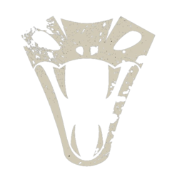
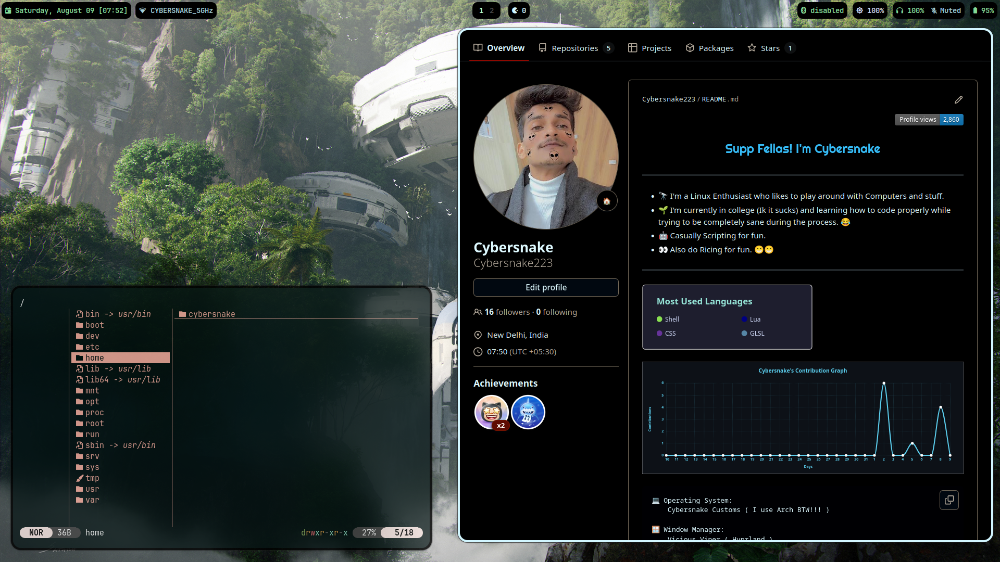
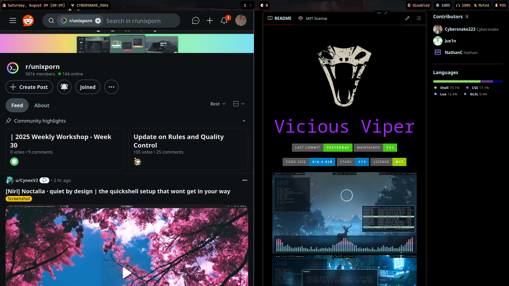
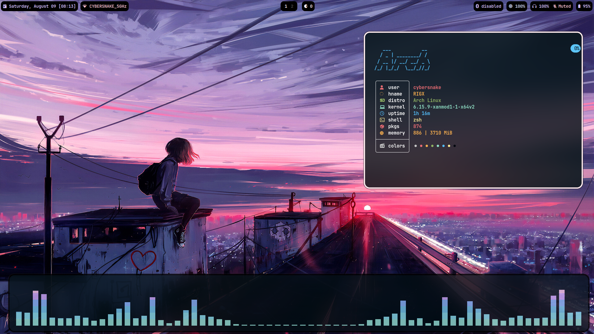
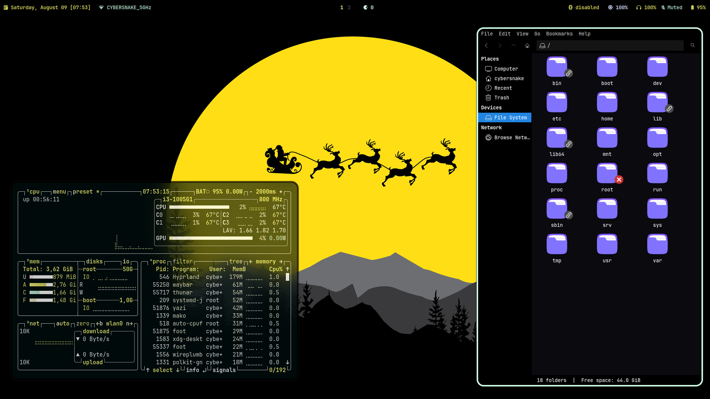
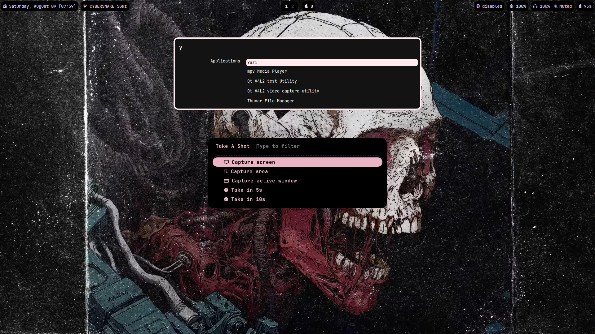
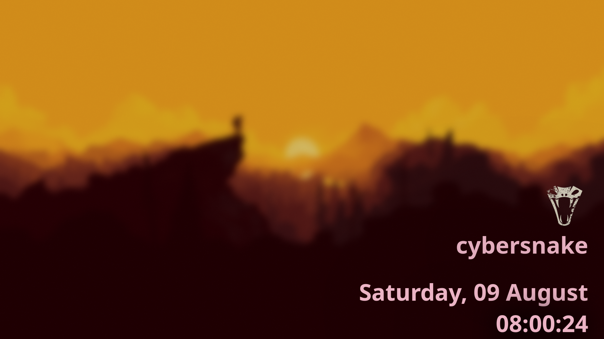
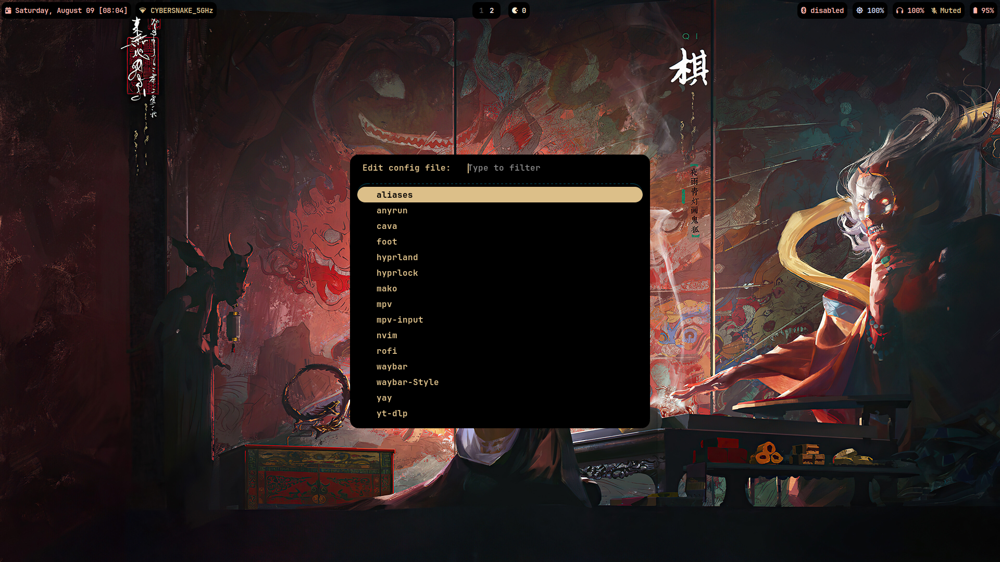

<div align="center">
  <p></p>
  <p><b><i> </b></p> 
   
</div>
<p></p>

<div align="center">
  <p></p>
  <p><b><i>   </i></b></p>
  
  
  
</div>
<p></p>





|  |  |
|---|---|
|  |  |
|  |  |
|  |  |


<div align="center"></div>


## _Basic Info_ 

<div align="center">
  <p> </p>

  
  - 🍀 ** Base ** - [Arch](https://archlinux.org/) 
  - 🌼 ** Wayland compositor ** - [Hyprland](https://hyprland.org/) 
  - ✨ ** Bar ** - [Waybar](https://github.com/Alexays/Waybar) 
  - 💦 ** GUI File Manager ** - [Thunar](https://gitlab.xfce.org/xfce/thunar) 
  - 🗄️ ** CLI File Manager ** - [Yazi](https://yazi-rs.github.io/docs/installation/) 
  - 🌷 ** Terminal ** - [Foot](https://github.com/DanteAlighierin/foot) 
  - 🍄 ** Shell ** - [Zsh](https://zsh.sourceforge.io/) 
  - 🪵 ** Notifications ** - [Mako](https://github.com/emersion/mako) 
  - 🌻 ** Launcher ** - [Anyrun](https://github.com/Kirottu/anyrun) 
  - 🚀 ** Dmenu Program ** - [Rofi (Lbonn Fork)](https://github.com/lbonn/rofi)
  - 🍁 ** Wallpaper ** - [Swaybg](https://codeberg.org/dnkl/wbg)
  - 🌐 ** Browser ** - [Thorium](https://thorium.rocks/) 
  - ❄️  ** Screen locker ** - [Swaylock Effects](https://github.com/DRAGONTOS/swaylock-effects) 
  - ⏬ ** Download Manager ** - [Aria2](https://github.com/aria2/aria2)
  - 🤖 ** System Fetch ** - [Nitch](https://github.com/ssleert/nitch)

</div>  


### _Needed packages:_

- (all of the above components) plus
- `xdg-desktop-portal-hyprland` - For Better Functionality and Compatiblity 
- `Cava` - Audio Visualizer 
- `Polkit-Gnome` - Authentication Agent
- `Grimblast-git` `wl-clipboard` - Screenshot Utility
- `Brightnessctl`  - Monitor and Keyboard Brightness Control 
- `Mpv` - Media Player
- `Pavucontrol` - Volume Control Panel. 
- `Xorg-Xwayland` - For Non-Wayland Apps and Games.
- `Fonts` - JetBrains Mono Nerd Fonts, Awesome Fonts and Nerd Font Symbols
- `Pipewire` - Audio Playback (pipewire, pipewire-pulse, pipewire-alsa)
- `Wireplumber` - Session Manager for Pipewire
- `Bleachbit` - Needed for the cleaner script
- `Cmus` - Terminal Audio Player
- `Btop` - Resource Monitor
- `Nmcli` - Connection Manager
- `Bluetoothctl` - Bluetooth Manager
- `Advcpmv(AUR)` - Alternate to cp and mv commands
- `Eza` - Alternative to ls command
- `Fd` - Fast Alternative to Find command


### Colorscheme used is inspired by Catppuccin Mocha as i absolutely love it 😉😉


# **Install Instructions**

> [!IMPORTANT] 
> DO BACKUP YOUR CURRENT CONFIGS BEFORE PROCEEDING FURTHER . I WILL NOT BE HELD RESPONSIBLE IF YOU LOSE YOUR OLD CONFIGS .


```
git clone https://github.com/Cybersnake223/Hypr
```

```
cd Hypr
```

```
cp -r .config/* $HOME/.config
```

```
cp -r .local/bin/scripts $HOME/.local/bin
```

```
cp -r .icons $HOME/.icons
```

```
cp -r .themes $HOME/.themes
```

> [!NOTE]
> This setup is more focused on laptops rather than desktops soo i'm keeping it super simple but yeahh you can also use it with desktops.    

### _This Repo also contains my custom scripts that i use with this setup for Misc things like downloading videos and audios from different platforms , switching wallpaper in hyprland with keyboard shortcuts. make sure to copy the scripts folder in /home/.local/bin and also add it to your PATH variable._

# LICENSE  

This Project is licensed under MIT License - see LICENSE fir more details.   
