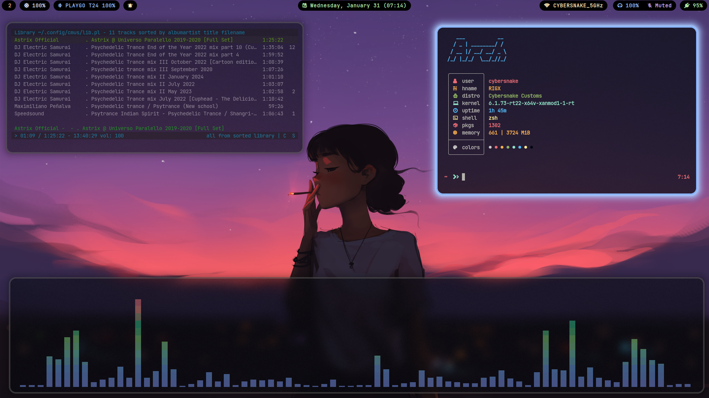
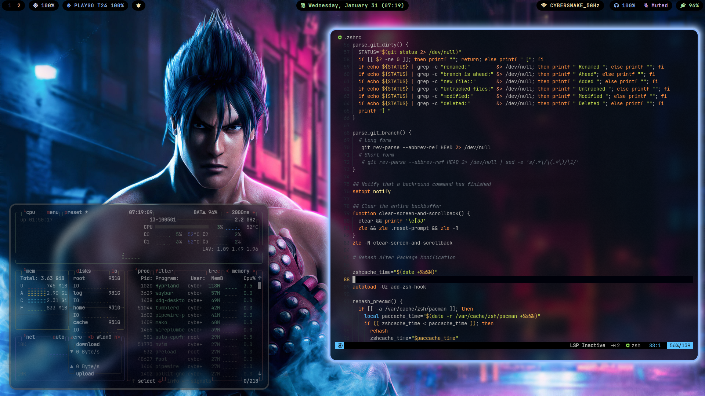
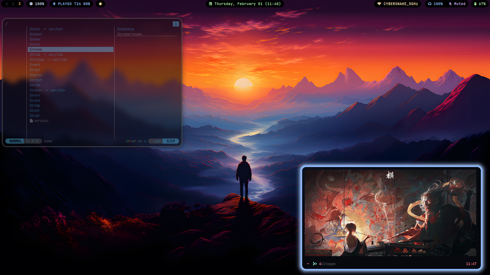

  

  

  
<b><i>  </i></b>

  
  
  

# SHOWCASE

## Basic Info 

  
 

  
  - 🍀 ** Distro ** - [Arch](https://archlinux.org/) 
  - 🌼 ** Wayland compositor ** - [Hyprland](https://hyprland.org/) 
  - ✨ ** Bar ** - [Waybar](https://github.com/Alexays/Waybar) 
  - 💦 ** GUI File Manager ** - [Thunar](https://gitlab.xfce.org/xfce/thunar) 
  - 🗄️ ** CLI File Manager ** - [Lf](https://github.com/gokcehan/lf) 
  - 🌷 ** Terminal ** - [Foot](https://github.com/DanteAlighierin/foot) 
  - 🍄 ** Shell ** - [Zsh](https://zsh.sourceforge.io/) 
  - 🪵 ** Notifications ** - [Mako](https://github.com/emersion/mako) 
  - 🌻 ** Launcher ** - [Rofi](https://github.com/lbonn/rofi) 
  - 🍁 ** Wallpaper ** - [Swaybg](https://codeberg.org/dnkl/wbg) 
  - ❄️  ** Screen locker ** - [Swaylock Effects](https://github.com/DRAGONTOS/swaylock-effects) 
  - ⏬ ** Download Manager ** - [Aria2](https://github.com/aria2/aria2)
  - 🤖 ** System Fetch ** - [Nitch](https://github.com/ssleert/nitch)

  

### Needed packages:
- (all of the above components) plus
- `cava` - Audio Visualizer 
- `polkit-gnome` - Authentication 
- `grimblast-git` `wl-clipboard` - for screenshot
- `brightnessctl`  - for monitor and keyboard brightness
- `mpv` - for media
- `pamixer` - for volume control notification. 
- `xorg-xwayland` - needed to run some non-wayland app especially games
- `fonts` - required awesome fonts. Most of configs here I used JetBrains Mono Nerd Font.
- `pipewire` - needed pipewire pipewire-pulse pipewire-alsa

### PS: This setup is more focused on laptops rather than desktops soo i'm keeping it super simple but you can also use it with desktops

This Repo also contains my custom scripts that i use with this setup for Misc things like downloading youtube videos and audio , switching wallpaper in hyprland with keyboard shortcuts. make sure to copy the scripts folder in /home/.local/bin and also add it to your PATH variable

Colorscheme used in this is inspired by Catppuccin Mocha as i love it soo much 😉😉

# Install Script Coming Soon.........
