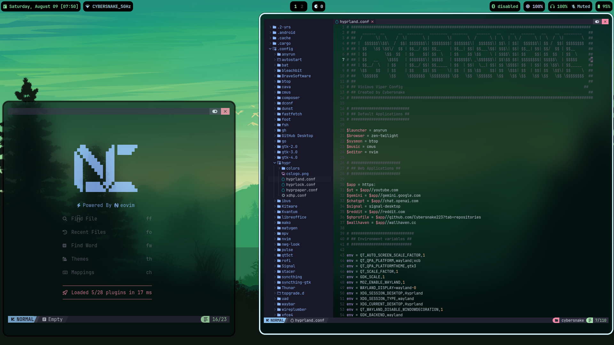
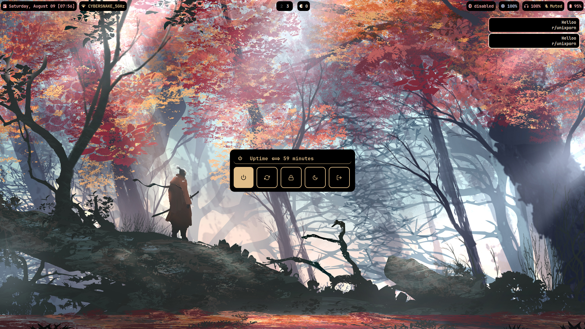

  

  
<b><i>  </i></b>

  
  
  

# SHOWCASE

## Basic Info 

  
 

  
  - 🍀 ** Base ** - [Arch](https://archlinux.org/) 
  - 🌼 ** Wayland compositor ** - [Hyprland](https://hyprland.org/) 
  - ✨ ** Bar ** - [Waybar](https://github.com/Alexays/Waybar) 
  - 💦 ** GUI File Manager ** - [Thunar](https://gitlab.xfce.org/xfce/thunar) 
  - 🗄️ ** CLI File Manager ** - [Yazi](https://yazi-rs.github.io/docs/installation/) 
  - 🌷 ** Terminal ** - [Foot](https://github.com/DanteAlighierin/foot) 
  - 🍄 ** Shell ** - [Zsh](https://zsh.sourceforge.io/) 
  - 🪵 ** Notifications ** - [Mako](https://github.com/emersion/mako) 
  - 🌻 ** Launcher ** - [Rofi](https://github.com/lbonn/rofi) 
  - 🍁 ** Wallpaper ** - [Swaybg](https://codeberg.org/dnkl/wbg)
  - 🌐 ** Browser ** - [Brave](https://brave.com/) 
  - ❄️  ** Screen locker ** - [Swaylock Effects](https://github.com/DRAGONTOS/swaylock-effects) 
  - ⏬ ** Download Manager ** - [Aria2](https://github.com/aria2/aria2)
  - 🤖 ** System Fetch ** - [Nitch](https://github.com/ssleert/nitch)

  

### Needed packages:

- (all of the above components) plus
- `Cava` - Audio Visualizer 
- `Polkit-gnome` - Authentication Agent
- `Grimblast-git` `wl-clipboard` - Screenshot Utility
- `Brightnessctl`  - Monitor and Keyboard Brightness Control 
- `Mpv` - Media Player
- `Pavucontrol` - Volume Control Panel. 
- `Xorg-Xwayland` - For Non-Wayland Apps and Games.
- `Fonts` - JetBrains Mono Nerd Fonts, Awesome Fonts and Nerd Font Symbols.
- `Pipewire` - Audio Playback (pipewire, pipewire-pulse, pipewire-alsa)
- `Wireplumber` - Session Manager for Pipewire
- `Bleachbit` - Needed for the cleaner script
- `Cmus` - Terminal Audio Player
- `Btop` - Resource Monitor
- `Nmcli` - Connection Manager
- `Bluetoothctl` - Bluetooth Manager

### PS: This setup is more focused on laptops rather than desktops soo i'm keeping it super simple but yeahh you can also use it with desktops. This setup is mostly keyboard centric.  

#### This Repo also contains my custom scripts that i use with this setup for Misc things like downloading videos and audios from different platforms , switching wallpaper in hyprland with keyboard shortcuts. make sure to copy the scripts folder in /home/.local/bin and also add it to your PATH variable.

#### Colorscheme used in this is inspired by Catppuccin Mocha as i love it soo much 😉😉 .

# Feel free to fork this repo and suggest changes. I'll really appericiate it.  

  

  
<b><i>  

